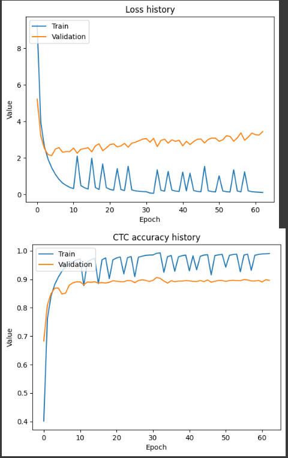

# OcrModelAppAndStuff

# Short description
OCR model trained IAM Handwriting Database
https://fki.tic.heia-fr.ch/databases/iam-handwriting-database - it contains mostly single words, so it's not gonna perform well on longer sequences (the longest sequence was 28 chars).
It's contains 3 components:
 - **ocr_tools** - core component
 - **ocr_api**
 - **ocr_webapp**

 
[](https://www.youtube.com/watch?v=U_rnX2eaNh4)

# Setup
  - ```pip install -r requirements.txt```

# Packages
```
fastapi==0.115.11
Flask==3.1.0
flask_wtf==1.2.2
numpy==1.26.0
pydantic==2.5.3
pytest==8.3.3
python-dotenv==1.0.1
Requests==2.32.3
tensorflow==2.17.0
tensorflow_intel==2.17.0
uvicorn==0.32.0
WTForms==3.2.1
```

### Project Structure
```
│   api_requests.py
│   config.py
│   custom_decorators.py
│   custom_logger.py
│   image.png
│   README.md
│   requirements.txt
│
├───images
├───models
│   └───model1
│           model.txt
│           num_to_char.pkl
│           ocr_model.h5
│
├───ocr_api
│   │   routes.py
│   │   run.py
│   │   test.py
│   │   uvicorn_log_config.json
│   │   __init__.py
│   ├───logs
│   │       api_logs.log
│   │
│   ├───tests
│   │   │   test_api.py
│   │   │   __init__.py
│   │   │
│   │   ├───logs
│   │   │       test_logs.log
├───ocr_tools
│   │   ocr_predictor.py
│   │
│   ├───logs
│   │       predictor_logs.log
│   │
├───ocr_webapp
│   │   .env
│   │   forms.py
│   │   routes.py
│   │   run.py
│   │   __init__.py
│   │
│   ├───logs
│   │       web_app.logs
│   │
│   ├───ssl
│   │       puturstuffhere.txt
│   │
│   ├───static
│   │   │   manifest.json
│   │   │   sw.js
│   │   │
│   │   ├───images
│   │   │       funny-error-icon.svg
│   │   │       github-icon.svg
│   │   │       icon-192x192.svg
│   │   │       icon-512x512.svg
│   │   │       maskable-icon-192x192.svg
│   │   │       Screenshot_1.png
│   │   │       Screenshot_2.png
│   │   │       youtube-icon.svg
│   │   │
│   │   └───styles
│   │           style.css
│   │
│   ├───templates
│   │       error_page.html
│   │       home.html
│   │       layout.html
│   │
│   └───tests
│       │   test_webapp.py
│       │   __init__.py
│       │
│       └───logs
│               test_logs.log
│
```

# More about model
### 1. Input Layer:
Accepts grayscale images of a defined height and width.

### 2. Convolutional Blocks (CNN):

Block 1 & 2: Each block performs convolution with increasing filter counts (32 then 64), followed by batch normalization, ReLU activation, and max pooling. This reduces spatial dimensions while capturing basic and then more complex features.
Block 3: Applies additional convolution with 64 filters, batch normalization, and ReLU activation without pooling, refining the feature maps further.

### 3. Permutation and Reshaping:
The output tensor from the CNN layers is rearranged by swapping the height and width dimensions. It is then reshaped so that the height and filter dimensions are merged into a single feature dimension, creating a sequential representation for subsequent processing.

### 4. Recurrent Layers (RNN):
Multiple bidirectional GRU layers process the sequential data. They capture temporal dependencies in the extracted features, which is critical for sequence tasks like OCR.

### 5.Dense Layers and Output:
A fully connected dense layer with ReLU activation (and dropout for regularization) further processes the features. The final dense layer uses a softmax activation to produce character probability distributions. An extra output unit is included to handle the blank label required by the CTC loss.

### 6. Compilation:
The model is compiled with the Adam optimizer and a custom CTC loss function, making it well-suited for OCR tasks where alignment between predictions and actual sequences can vary.

```python
def build_model4(
    char_to_num: keras.layers.StringLookup,
    img_width: int = IMAGE_WIDTH,
    img_height: int = IMAGE_HEIGHT,
    rnn_layers: int = RNN_LAYERS,
    rnn_units: int = RNN_UNITS,
    learning_rate: float = LEARNING_RATE
) -> keras.Model:

    img_input = keras.Input(shape=(img_height, img_width, 1), name="image")

    # CNN 1
    x = keras.layers.Conv2D(32, (3, 3), padding="same", use_bias=False)(img_input)
    x = keras.layers.BatchNormalization()(x)
    x = keras.layers.ReLU()(x)
    x = keras.layers.MaxPooling2D((2, 2), strides=2)(x)

    # CNN 2
    x = keras.layers.Conv2D(64, (3, 3), padding="same", use_bias=False)(x)
    x = keras.layers.BatchNormalization()(x)
    x = keras.layers.ReLU()(x)
    x = keras.layers.MaxPooling2D((2, 2), strides=2)(x)

    # CNN 3 (no pooling)
    x = keras.layers.Conv2D(64, (3, 3), padding="same", use_bias=False)(x)
    x = keras.layers.BatchNormalization()(x)
    x = keras.layers.ReLU()(x)

    # Axis swap (height and width) => (batch, W//4, H//4, 64)
    x = keras.layers.Permute((2, 1, 3), name="permute")(x)

    # Reshape: (batch, W//4, (H//4)*64)
    x = keras.layers.Reshape(
        (img_width // 4, (img_height // 4) * 64),
        name="reshape"
    )(x)

    for i in range(rnn_layers):
        x = keras.layers.Bidirectional(
            keras.layers.GRU(rnn_units, return_sequences=True, recurrent_dropout=0.1)
        )(x)

    x = keras.layers.Dense(rnn_units * 2, activation="relu", name="dense_1")(x)
    x = keras.layers.Dropout(0.3)(x)

    vocab_size = len(char_to_num.get_vocabulary())
    output = keras.layers.Dense(
        vocab_size + 1,
        activation="softmax",
        name="dense_2"
    )(x)

    model = keras.Model(inputs=img_input, outputs=output)
    model.compile(
        optimizer=keras.optimizers.Adam(learning_rate=learning_rate),
        loss=CTCLoss,
        metrics=[ctc_accuracy]
    )
    return model
```

### 7. CTC loss:
CTC loss, or **Connectionist Temporal Classification Loss**, is a loss function used primarily in sequence recognition tasks where the output length is not specified. It is particularly useful in speech recognition, image-to-text transcription (OCR) and other sequence processing model

 - **How does CTC Loss work?** <br>
Independence of input and output length: In many cases, the length of the input sequence (e.g., the number of frames in an audio recording) differs from the length of the expected output sequence (e.g., the number of characters in a transcription). CTC is designed to handle this problem.

- **Inserting a “blank” symbol**: <br>
 CTC uses an additional blank symbol (meaning “no character”) to help deal with the situation when the model does not predict a new character in each input frame. Blank symbols allow the model to differentiate between adjacent characters and ignore redundant predictions.

- **Different matches (alignment)**: <br>
CTC calculates the probability of different possible matches between the input sequence and the output sequence. For example, for an input audio signal that corresponds to the output “HELLO,” the model can generate multiple combinations (e.g., “H_E_LL_O_” where “_” is a blank) that will be interpreted as correct transcriptions.

In sequential tasks like speech recognition, the length of the input (e.g., the number of audio frames) is variable, as is the length of the output (e.g., the number of words or characters in a transcription). CTCLoss is designed specifically to deal with this variability in length, allowing for different input to output matches and inserting blank symbols in the appropriate place

```python
@register_keras_serializable(package="Custom")
def CTCLoss(y_true: TensorLike, y_pred: TensorLike, padding_token: int = PADDING_TOKEN) -> tf.Tensor:
    """
    y_true: (batch, max_len) with character indices and 99 as PAD (padding).
    y_pred: (batch, time_steps, vocab_size) - network output (logits or probabilities).
    """
    # Get batch size and number of time steps from shapes
    batch_size = tf.shape(y_true)[0]
    time_steps = tf.shape(y_pred)[1]

    # Calculate how many characters are not the padding token (actual sequence length per sample) - in other words count label len with no padding values
    label_length = tf.reduce_sum(
        tf.cast(tf.not_equal(y_true, padding_token), tf.int32),
        axis=1,       # sum along the character (sequence) axis
        keepdims=True # the result will then have shape (batch, 1)
    )

    # For the predictions y_pred, we assume each sample has input_length = time_steps
    input_length = time_steps * tf.ones((batch_size, 1), dtype=tf.int32)

    # ctc_batch_cost expects (y_true, y_pred, input_length, label_length)
    loss = keras.backend.ctc_batch_cost(
        y_true,       # true labels
        y_pred,       # predictions
        input_length, # number of time steps per sample
        label_length  # actual length of each label (no pads)
    )
    return loss


@register_keras_serializable(package="Custom")
def ctc_accuracy(y_true: TensorLike, y_pred: TensorLike, padding_token: int = PADDING_TOKEN) -> tf.Tensor:
    """
    y_true: (batch, max_len) with PAD=99
    y_pred: (batch, time_steps, vocab_size)
    """
    batch_size = tf.shape(y_pred)[0]
    time_steps = tf.shape(y_pred)[1]

    # The decoder requires the length of each input sequence
    # Here, we assume it's simply time_steps for all samples
    input_lengths = tf.fill([batch_size], time_steps)

    # Remove the padding from y_true and create a SparseTensor of actual labels
    y_true = tf.cast(y_true, tf.int64)
    indices = tf.where(tf.not_equal(y_true, padding_token))  # positions where value != 99
    values = tf.gather_nd(y_true, indices)                   # extract those values
    dense_shape = tf.cast(tf.shape(y_true), tf.int64)
    y_true_sparse = tf.SparseTensor(indices, values, dense_shape)

    # Greedy decoding of y_pred:
    # We transpose y_pred to shape (time_steps, batch, vocab_size),
    # because tf.nn.ctc_greedy_decoder expects it in this format.
    decoded, _ = tf.nn.ctc_greedy_decoder(
        tf.transpose(y_pred, [1, 0, 2]),
        input_lengths,
        merge_repeated=True
    )
    # Cast the decoded result to int64
    decoded_sparse = tf.cast(decoded[0], tf.int64)

    # Calculate accuracy via edit distance:
    # accuracy = 1 - average_edit_distance
    accuracy = 1 - tf.reduce_mean(
        tf.edit_distance(decoded_sparse, y_true_sparse, normalize=True)
    )
    return accuracy
```

# Training
For taining use **IAM_OCR_Model.ipynb**, for example in Colab. Use GPU and checkpoint system implemented in this notebook (when starting training set **LOAD_CHECKPOINT** to False and when starting again set it to True and set **initial_epoch** to last checkpoint number-1 and btw create folder in your Google Drive - **CHECKPOINT_PATH**). Each epoch can take around 20 minutes, you will need 10-20 to get some decent results but if you want to polish it, you can try more, change hyperparameters and etc.



There are pitches in the diagram because of re-running training from checkpoint, first epoch after re-run have higher loss and lower accuracy.
 - Mean edit distance: 11.4751
 - CER = 0.11723517055116535
 - Strict accuracy (prediction == label): 0.7260472832849441
 - Accuracy with margin (predictions has max 2 wrong chars): 0.9514724180837827

 **CER** - measures the accuracy of text recognition at the character level by calculating the ratio of incorrectly recognized characters to the total number of characters in the reference text. See Example: <br>
 ```
 Expected result: "hello world" (11 characters)
 OCR output: "hallo wrld" (9 characters)

 Errors: 'e' substituted with 'a' (1 substitution), 'o' deleted (1 deletion)
 CER = (1+1+0)/11 = 0.182 or 18.2%
 ```

 # Configuration
 Configuration is controlled using **config.py** file in root dir
 ```python
 from pathlib import Path
import json
from typing import Union
import os
import logging


class Config:
    # Overall
    ROOT_PATH: str = Path(__file__).resolve().parent

    # Model
    MODELS_FOLDER_PATH: str = f"{ROOT_PATH}/models/"
    TEST_IMAGES_FOLDER_PATH: str = f"{ROOT_PATH}/images/"
    MODEL_NAME: str = "model1"
    IMAGE_WIDTH: int = 128
    IMAGE_HEIGHT: int = 32
    PADDING_TOKEN: int = 99

    # API
    OCR_PORT: int = 5000
    OCR_HOST: str = "127.0.0.1"
    MAX_IMAGE_FILES: int = 10
    OCR_API_LOG_FILE: str = f"{ROOT_PATH}/ocr_api/logs/api_logs.log"

    # WEB APP
    WEB_APP_PORT: int = 8000
    WEB_APP_HOST: str = "127.0.0.1"
    WEB_APP_DEBUG: bool = True
    WEB_APP_LOG_FILE: str = f"{ROOT_PATH}/ocr_webapp/logs/web_app.logs"
    WEB_APP_USE_SSL: bool = False
    WEB_APP_SSL_FOLDER: str = f"{ROOT_PATH}/ocr_webapp/ssl_cert"
    WEB_APP_TESTING: bool = False

    # LOGGER
    UVICORN_LOG_CONFIG_PATH: Union[str, os.PathLike, Path] = f"{ROOT_PATH}/ocr_api/uvicorn_log_config.json"
    CLI_LOG_LEVEL: int = logging.DEBUG
    FILE_LOG_LEVEL: int = logging.DEBUG

    def get_uvicorn_logger(self) -> dict:
        with open(self.UVICORN_LOG_CONFIG_PATH) as f:
            log_config = json.load(f)
            log_config["handlers"]["file_handler"]["filename"] = f"{Config.ROOT_PATH}/ocr_api/logs/api_logs.log"
            return log_config
 ```
 # Predictor
 Prediction pipeline - **ocr_tools/ocr_predictor.py**
 - Loads a pre-trained OCR model (.h5) and character mapping dictionary (.pkl)
- Processes images to make them suitable for prediction
- Performs text recognition on multiple images

Methods
- `distortion_free_resize`: Resizes images while maintaining aspect ratio and adds padding
- `decode_batch_predictions`: Converts model output to readable text using CTC decoding
- `get_predictions`: Main pipeline that processes images and returns predicted text

 # Api
 Fast Api - basically interface for making prediction with model.

 ### Endpoints
  - **/** - only used to make sure api is working
  - **upload/** - endpoint for uploading your files and make predictions, number of files can be limited in config file (**MAX_IMAGE_FILES**)

### Test
```
cd ocr_api
pytest
```
### Run
```
python ocr_api/run.py
```

### Make request using python
```python
import requests

from config import Config

file_paths = [
    rf"{Config.TEST_IMAGES_FOLDER_PATH}\koken.png",
    rf"{Config.TEST_IMAGES_FOLDER_PATH}\koks.png"
]

files = []
for file_path in file_paths:
    with open(file_path, "rb") as file:
        files.append(('files', (file_path, file.read(), 'image/png')))

response = requests.post('http://localhost:5000/upload/', files=files)
print(response.json())
print(response.status_code)
```

# Web App
Flask PWA, so you can upload your images, get predictions and save them.

### Setup
Enter some **SECRET_KEY** in **ocr_webapp/.env**
### Endpoints
  - **/** - main page for everything, number of files can be limited in config file (**MAX_IMAGE_FILES**)

### Test
```
cd ocr_webapp
pytest
```
### Run
```
python ocr_webapp/run.py
```